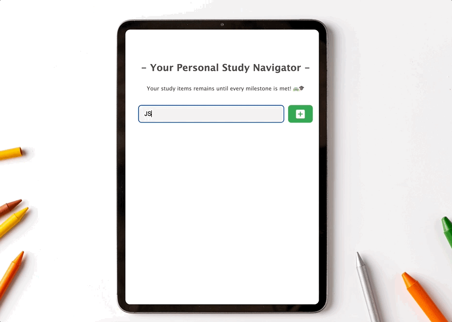

<h2 align="center">
  JS: Personal Study Navigator  
</h2>

<h3 align="center">
  Your study items remains until every milestone is met! 🛣️🎓
</h3>

## Project Idea 💡
> As I dive into the world of software engineering, I know I need a solid study plan. That's where the Study List Creator comes in. It's my go-to tool as a software engineer, helping me explore modern development tools. With dedication and a regular routine, I'm getting closer to reaching my goals.

### Key Requirement
    ○ Generate new items.
    ○ Review new items at a glance.
    ○ Save items even after refreshing.
    ○ Able to delete items.

### UI 
    ○ Intuitive and effectively communicates with screen interaction 

---
## Live Demo 🖥️

> **Please click this link** :  https://hannah-moon.github.io/26_JS_StudyList/ 

---
## Tools 🛠️

### Environment
> 
> 
>              

### Development
> 
> 
> 
> 

